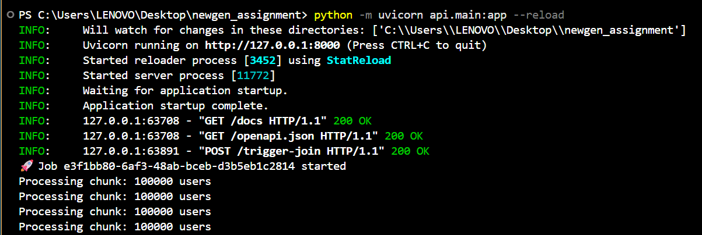
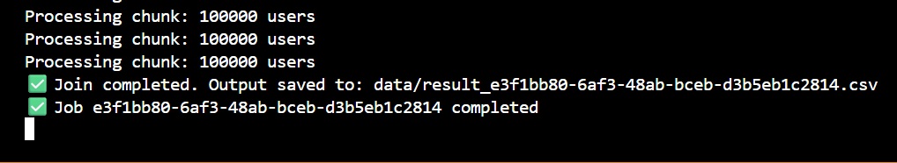
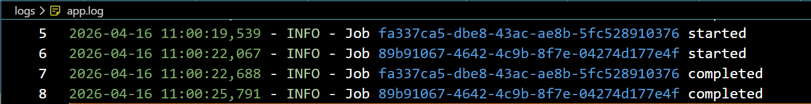

# 🚀 Assignment 1: Out-of-Core Data Join


## Overview

This project addresses the challenge of processing and joining large-scale datasets (~500MB each) under strict memory constraints (256MB RAM). The goal is to implement an efficient **out-of-core data processing pipeline** that avoids loading entire datasets into memory while maintaining performance.

---

## Problem Statement

Perform an **INNER JOIN** on two large CSV datasets:

* **Users Dataset (~500MB)**
* **Transactions Dataset (~500MB)**

---

### Constraints:

* Limited memory (256MB RAM)
* No full in-memory operations (e.g., `pandas.merge`)
* Must ensure scalability and stability under load

---

## Approach

### Hash-Based Chunk Join (Out-of-Core Processing)

The solution implements a **chunk-based hash join**, a practical adaptation of the classical hash join algorithm for memory-constrained environments.

### Workflow:

1. Load a **chunk of users data** into memory
2. Build a **hash map (user_id → user record)**
3. Stream through the transactions dataset
4. Perform **O(1) lookups** for matching records
5. Write joined results incrementally to disk
6. Repeat for all chunks

---

## Sample Data Preview

### Users Dataset


### Transactions Dataset


### Result (Joined Output)


---

## Design Rationale

* **Memory Efficiency:** Only a small portion of data is loaded at any time
* **Performance:** Hash-based lookup ensures constant-time joins
* **Scalability:** Handles datasets larger than available RAM
* **Simplicity:** Avoids complex partitioning while maintaining correctness

---

## Tech Stack

* Python
* CSV Streaming (built-in libraries)
* Memory-efficient data structures (hash maps)

---

## How to Run

### 1. Generate Data

```bash
python generate_data.py
```

### 2. Run Join

```bash
python join/chunk_join.py
```

---

## Output

* `result.csv` → Final joined dataset (INNER JOIN on `user_id`)
* Clean schema with no duplicate keys

---

## Possible Improvements

- Implement **External Hash Join (partitioned join)** to avoid repeated scans of the transactions file  
- Introduce **parallel chunk processing** to improve performance  
- Optimize disk I/O using **buffering or file partitioning**  
- Add indexing or pre-sorting to reduce lookup time  

---
---
---


# 🚀 Assignment 2: Non-Blocking API


## Overview

This assignment extends the join solution into a non-blocking backend API. The system ensures that API requests return immediately while heavy processing continues in the background.

Demonstrates backend scalability, concurrency, and asynchronous processing.

---

## Problem Statement

Build an API that allows users to trigger a large-scale join operation without blocking the server.

---

## Requirements:

* API should respond immediately (non-blocking)
* Join operation should run asynchronously in the background
* Support multiple concurrent requests
* Each request must be uniquely tracked

---

## Approach

### Asynchronous Job Execution

The system provides two approaches to handle background execution:

### 1. BackgroundTasks (FastAPI)
   * Uses FastAPI’s built-in BackgroundTasks
   * Suitable for lightweight async execution


### Workflow:
1. User sends request to /trigger-join
2. API generates a unique job_id
3. Background task is scheduled
4. API responds immediately
5. Join operation runs asynchronously


### 2. Thread-Based Execution
   * Uses Python threading module
   * Provides better concurrency and control


### Workflow:
1. User sends request to /trigger-join-thread
2. A new thread is created for the job
3. API returns immediately with job_id
4. Thread executes join independently

---

## API Endpoints

### Trigger Join (BackgroundTasks)
POST /trigger-join

### Trigger Join (Thread-Based)
POST /trigger-join-thread

---

## Concurrency Design
* Each request generates a unique job_id
* Multiple jobs run independently
* No blocking of API responses
* Separate output files ensure isolation

---

## Logging

Logs are stored in:
logs/app.log

---

## Tracks:
* Job start
* Job completion
* Execution type (Background / Thread)

---

## Approaches Comparison

| Aspect          | BackgroundTasks           | Thread-Based    |
| --------------- | ------------------------- | --------------- |
| Execution Model | FastAPI background system | Separate thread |
| Response Time   | Immediate                 | Immediate       |
| Concurrency     | Limited                   | Better          |
| Control         | Less control              | More control    |
| Complexity      | Low                       | Moderate        |

---

## Tech Stack

* Python
* FastAPI (Backend API framework)
* Uvicorn (ASGI server)
* Threading (Concurrency handling)

---

## How to Run

### Start API Server
```bash
python -m uvicorn api.main:app --reload
```

### Open API Docs
```bash
http://127.0.0.1:8000/docs
```

## Output

Each API request generates a separate output file:

- `data/result_f47b0dbb-918f-47c8-88cd-5563cab9ef7c.csv`

### Details:

- Contains the result of the **INNER JOIN** between users and transactions  
- Each file is uniquely identified using `job_id`  
- Ensures **no data overwrite** when multiple jobs run concurrently  
- Output is generated asynchronously after the API response  

### Example:

- `data/result_b79fae1e-4abf-4a54-8714-cced7de36e3d.csv`
- `data/result_89b91067-4642-4c9b-8f7e-04274d177e4f.csv`

---

## Execution Proof

### API Running (Uvicorn Server)


### Job Execution (Chunk Processing)


### Logging (BackgroundTasks - Concurrency)


### Logging (Thread-Based Concurrency)


---

## Possible Improvements
* Integrate distributed task queues (e.g., Celery + Redis)
* Add job status tracking API
* Implement retry mechanism for failed jobs
* Introduce queue management system for large workloads

---