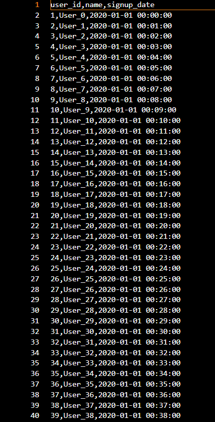
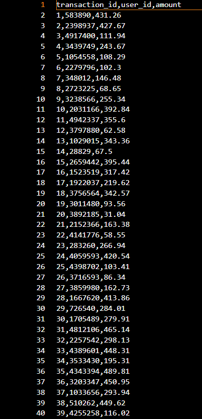
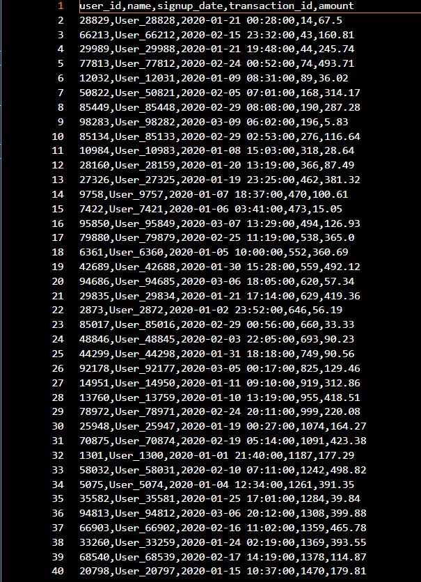

# Scalable Data Processing API

## Overview

This project addresses the challenge of processing and joining large-scale datasets (~500MB each) under strict memory constraints (256MB RAM). The goal is to implement an efficient **out-of-core data processing pipeline** that avoids loading entire datasets into memory while maintaining performance.

---

## Problem Statement

Perform an **INNER JOIN** on two large CSV datasets:

* **Users Dataset (~500MB)**
* **Transactions Dataset (~500MB)**

---

## Sample Data Preview

### Users Dataset


### Transactions Dataset


### Result (Joined Output)


---

### Constraints:

* Limited memory (256MB RAM)
* No full in-memory operations (e.g., `pandas.merge`)
* Must ensure scalability and stability under load

---

## Approach

### Hash-Based Chunk Join (Out-of-Core Processing)

The solution implements a **chunk-based hash join**, a practical adaptation of the classical hash join algorithm for memory-constrained environments.

### Workflow:

1. Load a **chunk of users data** into memory
2. Build a **hash map (user_id → user record)**
3. Stream through the transactions dataset
4. Perform **O(1) lookups** for matching records
5. Write joined results incrementally to disk
6. Repeat for all chunks

---

## Design Rationale

* **Memory Efficiency:** Only a small portion of data is loaded at any time
* **Performance:** Hash-based lookup ensures constant-time joins
* **Scalability:** Handles datasets larger than available RAM
* **Simplicity:** Avoids complex partitioning while maintaining correctness

---

## Trade-offs

| Aspect       | Decision                                                 |
| ------------ | -------------------------------------------------------- |
| Disk I/O     | Increased due to multiple scans of transactions file     |
| Complexity   | Kept low for reliability and maintainability             |
| Optimization | External Hash Join identified as a potential improvement |

---

## Possible Improvements

* **External Hash Join (Partitioned Join)** to reduce repeated scans
* Parallel processing for chunk execution
* Integration with analytical engines (e.g., DuckDB) for optimized joins
* Progress tracking and job monitoring

---

## Tech Stack

* Python
* CSV Streaming (built-in libraries)
* Memory-efficient data structures (hash maps)

---

## How to Run

### 1. Generate Data

```bash
python generate_data.py
```

### 2. Run Join

```bash
python join/chunk_join.py
```

---

## Output

* `result.csv` → Final joined dataset (INNER JOIN on `user_id`)
* Clean schema with no duplicate keys

---

## Key Takeaways

* Demonstrates **out-of-core data processing**
* Implements a **memory-aware join algorithm**
* Reflects **real-world backend/data engineering challenges**
* Balances **efficiency, simplicity, and scalability**

---

## Author
Simran Kumari
